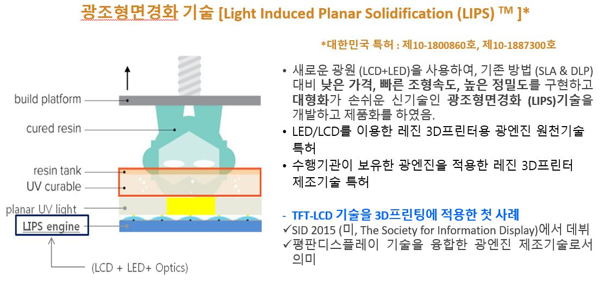
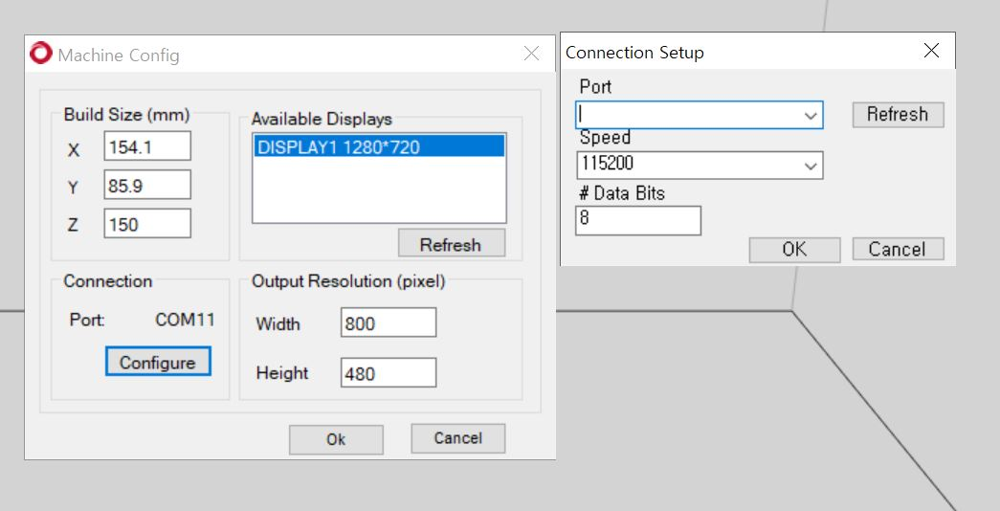
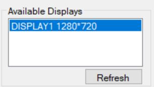

# slicer.resin3dprinter
LIPS (Light Induced Planar Solidification) 방식에 최적화된 Resin 3D printer Slicer 개발, to develop Resins 3d printer slicer for LIPS Tech.

## 개요
이 프로그램은 레진 3D 프린터를 위한 슬라이서 개발로 대형 출력물에 적합한 LIPS 방식의 기술에 최적화를 위한 프로젝트임.
LIPS (Ligth Induced Planer Solidification) 광조형 면경화 방식은 류진랩에 의하여 제안되어진 기술로 SLA 방식이나 DLP 방식을 개선하여 대형 출력물을
출력하기에 적합한 기술로 발전시킨 기술임.

 

본 프로젝트  대형 레진 3D 프린터를 위한 슬라이서를 개발하기 위하여 제안되어졌음

## 시작방법
- 프로그램을 설치한다 : 파일주에 exe 파일을 클릭하여 프로그램을 설치한다.

- 3프린터와 프로그램을 연결을 한다 : USB 선을 이용하여 컴퓨터와 3D 프린터를 연결한다.

- Serial 통신을 연결한다 : file 의 configure machine 을 선택 후 COM 을 찾아 OK 버튼을 누른다.

   
   
- HDMI 선을 Display port 에 연결한다 
- Windows 화면을 Dual Extention 화면으로 변경한다.
- 출력할 화면을 선택한다.

   
   
- file open 아이콘을 눌러 STL 파일을 open한다.

   
   
- slicing 화면으로 이동한다.

   
   
- slcing 아이콘을 눌러 슬라이싱을 실행한다.

   
   
- 연결버튼을 눌러 3D 프린터와 연결을 해준다.

   
   
- 시작버튼을 눌러 실행을한다.

    

## 개발방법v

- c# 언어로 개발되어졌으며
- Visual Studio를 사용하여 빌드진행함

## 라이센스

GPL3.0  라이센스
